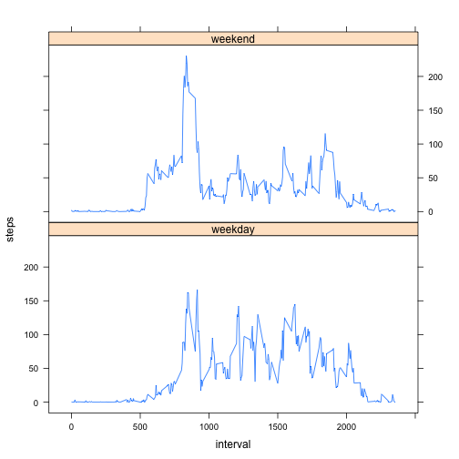

##Loading and preprocessing the data:

```r
library(dplyr)
```

```
## 
## Attaching package: 'dplyr'
## 
## The following objects are masked from 'package:plyr':
## 
##     arrange, count, desc, failwith, id, mutate, rename, summarise,
##     summarize
## 
## The following object is masked from 'package:stats':
## 
##     filter
## 
## The following objects are masked from 'package:base':
## 
##     intersect, setdiff, setequal, union
```

```r
library(lubridate)
```

```
## 
## Attaching package: 'lubridate'
## 
## The following object is masked from 'package:plyr':
## 
##     here
```

```r
library(lattice)
activity.csv <- unzip("activity.zip")
data <- read.csv("activity.csv", stringsAsFactors=FALSE)
```
##What is mean total number of steps taken per day?
###1) Histogram of total number of steps taken per day.

```r
#find the sum of steps for each day.
sums <- aggregate(steps ~ date, data, sum)
#make a histogram of the average number of steps taken each day.
hist(sums$steps, ylab="frequency", xlab="steps per day", 
     main="total number of steps per day")
```

 

###2) Calculate and report the mean and median total number of steps taken per day.

```r
mean(sums$steps)
```

```
## [1] 10766.19
```

```r
median(sums$steps)
```

```
## [1] 10765
```
##What is the average daily activity pattern? 
###1) Make a line plot of interval vs. average number of steps taken per interval over all the days in the data set.

```r
#find mean of steps per interval.
mspi <- aggregate(steps ~ interval, data, mean)
#make the plot.
plot(mspi$interval, mspi$steps, type="l", xlab="interval", ylab="average steps over all days", main="line plot of average steps per interval")
```

 

###2) Find the 5 minute interval which, on average across all the days of the data set, contains the maximimum number of steps.

```r
mspi[which(mspi$steps == max(mspi$steps)),]
```

```
##     interval    steps
## 104      835 206.1698
```
##Impute missing values. 
My strategy for imputing missing values is to replace the missing values with the average number of steps for that interval averaged over all days of the data set for which values exist.
###1) Calculate and report the total number of missing values in the data set.

```r
rows_with_missing_values <- data[which(is.na(data$steps)),]
number_missing <- length(rows_with_missing_values$steps)
number_missing
```

```
## [1] 2304
```
###2) Fill the missing values with the mean for that day.

```r
#find the mean of steps for each interval.
means <- aggregate(steps ~ interval, data, mean)
```
###3) Create a new dataset equal to original with missing data filled in.

```r
#add a column of interval means to the original data set.
merged <- merge(data, means, by.x="interval", by.y="interval")
#arrange it by date for clarity.
merged <- arrange(merged, date)
#replace NA valued with interval means.
merged$steps.x[is.na(merged$steps.x)] <- merged$steps.y[is.na(merged$steps.x)]
#remove extra column from merged.
new_data <- select(merged, interval, steps.x, date)
#assign original column names to new data set.
names(new_data) <- c("interval", "steps", "date")
```
###4) Make a histogram of total number of steps taken per day using the new data set and calculate and report the mean and median total number of steps taken per day using the new data set.

```r
#find the sum of steps for each day.
new_sums <- aggregate(steps ~ date, new_data, sum)
#make a histogram of the average number of steps taken each day.
hist(new_sums$steps, ylab="frequency", xlab="steps per day", main="total number of steps per day")
```

 

```r
mean(new_sums$steps)
```

```
## [1] 10766.19
```

```r
median(new_sums$steps)
```

```
## [1] 10766.19
```
While the median is 1.19 steps higher than the median for the original data set, neither mean nor median changed significantly with the addition of these imputed values, since 
they were averages of the steps per interval over the whole data set.

## Are there differences in activity patterns between weekdays and weekends?

```r
wday <- mutate(new_data, day=wday(new_data$date))
for (n in 1:nrow(new_data)) {
    if(wday$day[n] == 7 | wday$day[n] == 1) {
        wday$day[n] <- "weekend"
    }
    else {
        wday$day[n] <- "weekday"
        }
}
f <- subset(wday, wday$day=="weekend")
g <- subset(wday, wday$day=="weekday")
fmeans <- aggregate(steps ~ interval, f, mean)
gmeans <- aggregate(steps ~ interval, g, mean)
fmeans <- mutate(fmeans, day="weekend")
gmeans <- mutate(gmeans, day="weekday")
end <- rbind(fmeans, gmeans)
xyplot(steps ~ interval | day, data=end, type="l", layout=c(1,2))
```

 

There does seem to be a little difference.  People walk around earlier in the morning on the weekdays (between 600 and 800, or 6 and 8 AM).  Also, they are more sedentary in the afternoon (after 1200, or 12 PM) on the weekdays, probably sitting at their desks, when on the weekends people seem to be more active overall.
